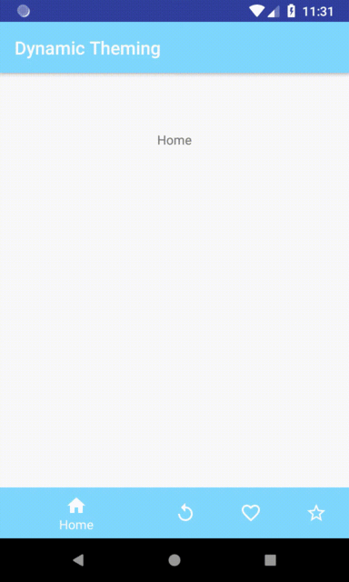

# Dynamically Change Themes Sample

This is a sample demonstrating how to change themes at runtime.

Sample app was inspired from [this medium post](https://medium.com/mindorks/mastering-android-themes-chapter-4-591e03320182)

 
